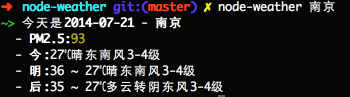

# node-weather

[](https://travis-ci.org/SFantasy/node-weather)

[](https://nodei.co/npm/node-weather/)

在终端中获取天气

## Install

```
[sudo] npm install node-weather [-g]
```

## Usage

- Look for help

```
node-weahter -h (--help)
```

- Get weather info

```
node-weather 北京
```

## Screenshot



## License

The MIT License
